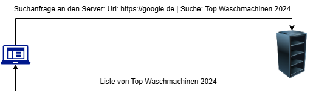

# 24-11-wiki

## Frontend vs. Backend

- `Frontend` : Die Ansicht für den Benutzer/Benutzeroberfläche, Design und Layout. Interaktion des Benutzers
- `Backend` : Der Benutzer sieht die Backend Services nicht bzw. interagiert damit nicht direkt.
- `Client` : Das Benutzergerät
- `Server` : ist ein Gerät, das Anfragen von Clients verarbeitet und die angeforderten Dienste bereitstellt

## Internet

- `Internet` : Globales Netzwerk, welches die weltweite Kommunikation ermöglicht durch den Zusammenschluss von Servern.

## Pfade

- `absoluter Pfad` : Geht von dem Ursprung des Dateisystems aus (Windows: `C://`)
- `relativer Pfad` : Geht von dem Verzeichnis aus, in welchem ihr euch befindet. Startet mit `./`

## Entwicklungsumgebung

- `IDE` : Die Applikation, in welcher ihr den Code entwicklet. **Visual Stusio Code** wäre ein Beispiel

## Software vs. Hardware

- `Software` : Programm/Anwendungen. Man kann Software nicht anfassen
- `Hardware` : Physische Komponenten des Computers/Servers. Beispiel: **CPU**
- `Betriedssystem (OS)` : Windows, Android, Linux, iOS. Schnittstelle zwischen Hardware und Software.

## Hardware Komponenten

- `CPU` : Central Processing Unit - Prozessor
- `RAM` : Random Access Memory - Arbeitsspeicher, Kurzzeitspeicher